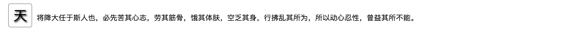
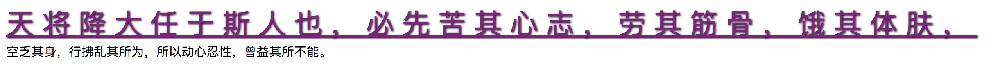
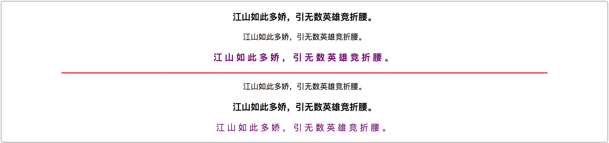
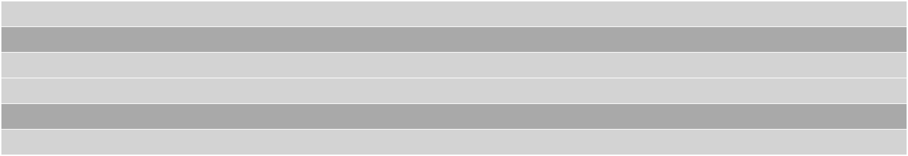
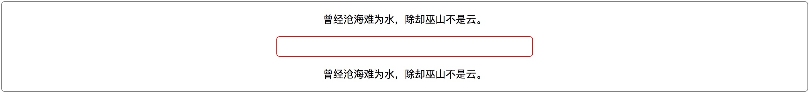
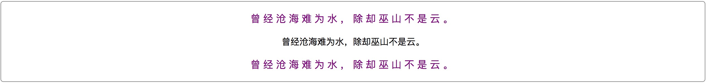

# css 高级选择器

## 概述

CSS高级选择器区别于CSS普通选择器，它并非是通过HTML页面标签中一些可见的因素进行选择（如标签名，属性名、值，同级关系，嵌套结构等），也不是对一些简单的操作条件进行选择（如鼠标悬浮，鼠标点击，输入框获得焦点等），而是对标签元素的结构、标签元素的索引、标签元素的状态等一些更为复杂的条件下进行的选择，甚至能改变现有标签的状态结构。

很多CSS高级选择器都是在CSS3标准后诞生的，它们出现一方面让标签的选择更加的简便精准，一方面又让HTML的DOM结构更加清晰，顺应了标签结构语义化，可读性更强的趋势，同时也使得搜索引擎能更好的检索到我们所开发的网站（SEO）。能正确灵活地运用CSS的高级选择器，不仅能让我们开发的网站功能更加地强大，表现更加地“绚丽”，还能更大程度地增加用户的体验度，让我们开发的网站在用户心目中留下一个深刻的好印象。

## 伪元素选择器

该类选择器主要用于向指定的选择器添加指定的效果，主要有四个伪元素：

#### 1. :first-letter

选择“块级元素”文本段落中的首个字符，只能对“块级元素”生效。

```html
<p>天将降大任于斯人也，必先苦其心志，劳其筋骨，饿其体肤，空乏其身，行拂乱其所为也，所以动心忍性，增益其所不能。 </p>
```

```css
        p:first-letter {
            border: 1px solid #808080;
            /*
            border-radius： 向元素添加圆角边框：
            */
            border-radius: 5px;
            padding: 5px 10px;
            font-size: 30px;
            /*
            text-shadow: 文本的阴影效果
            */
            text-shadow: 2px 2px 3px #000;
            margin: 10px;
        }
```




#### 02. :first-line

选择“块级元素”文本段落中的首行文本，只能对“块级元素”生效。

```html
<p>天将降大任于斯人也，必先苦其心志，劳其筋骨，饿其体肤，空乏其身，行拂乱其所为也，所以动心忍性，增益其所不能。 </p>
```

```css
p:first-line {
    font-size: 36px;
    letter-spacing: 10px;
    color: #800080;
    text-shadow: 1px 1px 2px #000;
    text-decoration: underline;
}
```




#### 03. :before

在指定的选择器之前插入一段内容。插入的内容默认为“行内元素”，可以通过“display”强制装换显示类型。

```html
<p>蜡笔小新</p>
```

```css
p {
    letter-spacing: 5px;
    font-size: 25px;
    color: #ff4500;
    text-shadow: 1px 1px 2px #000;
}
p:before {
    /*插入内容，这里以插入图片为例*/
    content: 'test11';

    position: relative;
    top: 20px;
}
```


> 提示：如果需要插入文本字符串，则直接将字符串赋值给 `content` 属性，如：`content: 'Hello, world!'`

#### 04. :after

在指定的选择器之后插入一段内容，使用方式和“:before”一样。插入的内容默认也是为“行内元素”，同样可以通过“display”强制装换显示类型。

```html
<p>蜡笔小新</p>
```

```css
p {
    letter-spacing: 5px;
    font-size: 25px;
    color: #ff4500;
    text-shadow: 1px 1px 2px #000;
}
p:after {
    /*插入内容，这里以插入图片为例*/
    content: url('xiaoxin.jpg');

    position: relative;
    top: 20px;
}
```


> 提示：如果需要插入文本字符串，则直接将字符串赋值给 `content` 属性，如：`content: 'Hello, world!'


## 结构性伪类选择器

该类选择器主要用于当前选择器精确地通过元素“索引值”或“匹配类型”的索引值定位到该选择器的同级指定元素。该类选择器的格式是“基本选择器（包括‘后代选择器’、‘自选择器’、‘同级选择器’等）”或“属性选择器（包括各种带条件的属性选择器）”+“结构性伪类选择器”的形式。该类选择器主要有以下形式：

####  01. :first-child
对该类所有父元素中的首个子元素进行选择。

```html
<section>
    <p>江山如此多娇，引无数英雄竞折腰。</p>
    <p>江山如此多娇，引无数英雄竞折腰。</p>
    <p>江山如此多娇，引无数英雄竞折腰。</p>
</section>
```

```css
section {
    border: 1px solid #808080;
    border-radius: 5px;

    text-align: center;
}
section > p:first-child {
    color: #800080;
    font-size: 18px;
    letter-spacing: 5px;
}
```


#### 02. :last-child

对该类所有父元素中的最后一个子元素进行选择。

```html
<section>
    <p>江山如此多娇，引无数英雄竞折腰。</p>
    <p>江山如此多娇，引无数英雄竞折腰。</p>
    <p>江山如此多娇，引无数英雄竞折腰。</p>
</section>
```

```css
section {
    border: 1px solid #808080;
    border-radius: 5px;

    text-align: center;
}
section > p:last-child {
    color: #800080;
    font-size: 18px;
    letter-spacing: 5px;
}
```


## 03. :first-of-type

对该类所有父元素中的首个匹配到类型的子元素进行选择。

```html
<div class="wrap">
    <section>
        <h3>江山如此多娇，引无数英雄竞折腰。</h3>
        <p>江山如此多娇，引无数英雄竞折腰。</p>
        <p>江山如此多娇，引无数英雄竞折腰。</p>
    </section>
    <hr width="80%" color="red">
    <article>
        <h3>江山如此多娇，引无数英雄竞折腰。</h3>
        <p>江山如此多娇，引无数英雄竞折腰。</p>
        <p>江山如此多娇，引无数英雄竞折腰。</p>
    </article>
</div>
```

```css
div.wrap {
    border: 1px solid #808080;
    border-radius: 5px;

    text-align: center;
}
section > h3:first-of-type {
    color: #800080;
    letter-spacing: 5px;
}
article > p:first-of-type {
    color: #800080;
    font-size: 18px;
    letter-spacing: 5px;
}
```


#### 04. :last-of-type

对该类所有父元素中的最后一个匹配到类型的子元素进行选择。

```html
<div class="wrap">
    <section>
        <h3>江山如此多娇，引无数英雄竞折腰。</h3>
        <p>江山如此多娇，引无数英雄竞折腰。</p>
        <h3>江山如此多娇，引无数英雄竞折腰。</h3>
    </section>
    <hr width="80%" color="red">
    <article>
        <p>江山如此多娇，引无数英雄竞折腰。</p>
        <h3>江山如此多娇，引无数英雄竞折腰。</h3>
        <p>江山如此多娇，引无数英雄竞折腰。</p>
    </article>
</div>
```

```css
div.wrap {
    border: 1px solid #808080;
    border-radius: 5px;

    text-align: center;
}
section > h3:last-of-type {
    color: #800080;
    letter-spacing: 5px;
}
article > p:last-of-type {
    color: #800080;
    font-size: 18px;
    letter-spacing: 5px;
}
```




#### 05. :only-child

对该类所有父元素中只含有唯一所匹配（不包含同级元素/只有一个子元素）的子元素进行选择。

```html
<div class="wrap">
    <section>
        <p>江山如此多娇，引无数英雄竞折腰。</p>
    </section>
    <hr width="80%" color="red">
    <section>
        <p>江山如此多娇，引无数英雄竞折腰。</p>
        <p>江山如此多娇，引无数英雄竞折腰。</p>
    </section>
</div>
```

```css
div.wrap {
    border: 1px solid #808080;
    border-radius: 5px;

    text-align: center;
}

section > p:only-child {
    color: #800080;
    font-size: 18px;
    letter-spacing: 5px;
}
```


#### 06. :only-of-type

对该类所有父元素中只含有唯一所匹配类型的子元素进行选择。

```html
<div class="wrap">
    <section>
        <p>江山如此多娇，引无数英雄竞折腰。</p>
        <h3>江山如此多娇，引无数英雄竞折腰。</h3>
        <p>江山如此多娇，引无数英雄竞折腰。</p>
    </section>
    <hr width="80%" color="red">
    <article>
        <h3>江山如此多娇，引无数英雄竞折腰。</h3>
        <p>江山如此多娇，引无数英雄竞折腰。</p>
        <h3>江山如此多娇，引无数英雄竞折腰。</h3>
    </article>
</div>
```

```css
div.wrap {
    border: 1px solid #808080;
    border-radius: 5px;

    text-align: center;
}
section > h3:only-of-type {
    color: #800080;
    letter-spacing: 5px;
}
article > p:only-of-type {
    color: #800080;
    font-size: 18px;
    letter-spacing: 5px;
}
```


## 07. :nth-child(n)

对其父元素的第“n”个子元素进行选择，通过设置参数“n”指定为第几个元素。

```html
<section>
    <p>江山如此多娇，引无数英雄竞折腰。</p>
    <p>江山如此多娇，引无数英雄竞折腰。</p>
    <p>江山如此多娇，引无数英雄竞折腰。</p>
</section>
```

```css
section {
    border: 1px solid #808080;
    border-radius: 5px;

    text-align: center;
}
section > p {
    font-size: 18px;
    letter-spacing: 5px;
}
section > p:nth-child(1) {
    color: red;
}
section > p:nth-child(2) {
    color: green;
}
section > p:nth-child(3) {
    color: blue;
}
```


该选择器不仅能准确的匹配到第“几”个指定类型的元素，还能对匹配类型元素的“奇偶索引”值进行选择。`odd` 表示奇数，`even` 表示偶数。

```html
<article>
    <section></section>
    <section></section>
    <section></section>
    <section></section>
    <section></section>
    <section></section>
</article>
```

```css
article > section {
    height: 35px;
}
article > section:nth-child(odd) {
    background-color: darkgray;
}
article > section:nth-child(even) {
    background-color: lightgrey;
}
```


除此之外，“:nth-child(n)”这个结构性伪类选择器的参数还具备运算特性，如：

```html
<article>
    <section></section>
    <section></section>
    <section></section>
    <section></section>
    <section></section>
    <section></section>
</article>
```

```css
article > section {
    height: 35px;
    background-color: lightgrey;
    margin: 1px;
}
article > section:nth-child(3n - 1) {
    background-color: darkgray;
}
```



这样的参数我们叫做“带增量计算”的参数，参数内的 `n` 是一个增量，它从“0”开始计数，每次“+1”。如上代码，第一生效时机是“3 \* 0 - 1”（计算结果小于1），无效；第二次生效时机是“3 \* 1 - 1”，为第2个；第三次生效时机是“3 * 2 - 1”，为第5个，以此类推。


#### 08. :nth-last-child(n)

该选择器和“:nth-child(n)”的特性基本一致，唯一的不同点就是该选择器的索引值是从该选择器匹配到的元素的同级元素中的最后一个开始进行计算的。主要运用范畴是，当这些标签元素是动态生成的，也就是说生成数量不固定的时候，用“:nth-last-child(n)”能精确的定位到同级元素中的最后一个（这里使用“:last-child”会更简便）、最后几个，或从最后开始有选择地进行计数选择。


#### 9. :empty

  该选择器会匹配所有，或指定基本选择器内没有元素（没有子节点）的标签元素。

```html
<article>
    <p>曾经沧海难为水，除却巫山不是云。</p>
</article>
<div></div>
<section>
    <p>曾经沧海难为水，除却巫山不是云。</p>
</section>
```

```css
div.wrap {
    border: 1px solid #808080;
    border-radius: 5px;

    display: flex;
    flex-flow: column wrap;
    justify-content: center;
    align-items: center;
}

:empty {
    width: 400px;
    height: 30px;
    border: 1px solid red;
    border-radius: 5px;
}
```




#### 14. :not(selector)

  该选择器是用于排除指定元素的选择器。

```html
<div class="wrap">
    <p>曾经沧海难为水，除却巫山不是云。</p>
    <p class="special">曾经沧海难为水，除却巫山不是云。</p>
    <p>曾经沧海难为水，除却巫山不是云。</p>
</div>
```

```css
div.wrap {
    border: 1px solid #808080;
    border-radius: 5px;

    text-align: center;
}

div.wrap > p:not(.special) {
    font-size: 18px;
    letter-spacing: 5px;
    color: #800080;
}
```

