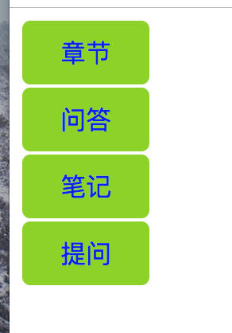

# css 导航栏案例分析

## 1. 垂直案例分析


#### 1. 基本代码形成

1. 分析 我们使用ul标签来制作导航栏

	```
	<ul>
	    <li>
	        <a href="#">章节</a>
	    </li>
	    <li>
	        <a href="#">问答</a>
	    </li>
	    <li>
	        <a href="#">笔记</a>
	    </li>
	    <li>
	        <a href="#">提问</a>
	    </li>
	</ul>
	```
2. 修改代码的样式,把列表的点去掉,增加导航的语义化,去掉下划线,增加背景颜色

	```css
		/*
		重置所有样式
		*/
		*{margin:0; padding:0; font-size:14px;}
       ul{
            /*
            1.把 边框去掉
            2. 把li标签上面的点号去掉
            */
            margin: 0;
            padding: 0;
            width: 80px;
            list-style-type: none;

        }
        li{
            /*
            给li标签整个增加背景颜色
            给li标签增加下面的分析
            */
            background-color: #8bd400;
            margin-bottom: 2px;
            height: 40px;

        }

        a{
            /**
            把a标签的下划线去掉
             */
            text-decoration: none;
        }
	```
	
3. (最终代码)把文字放在中间,增加鼠标过去的时候的颜色改变

    >css
  
    ```


        ul{
            /*
            1.把 边框去掉
            2. 把li标签上面的点号去掉
            */
            margin: 0;
            padding: 0;
            width: 80px;
            list-style-type: none;

        }
        li{
            /*
            给li标签整个增加背景颜色
            给li标签增加下面的分析
            */
            background-color: #8bd400;
            margin-bottom: 2px;
            height: 40px;
            border-radius: 5px;
        }

        a{
            /**
            把a标签的下划线去掉
             */
            display:block;
            height: 40px;
            text-decoration: none;
            /*
            把文字放在中间
            */
            text-align: center;
            /*
            把文字行间距和整个block一样,那么文字就居中了
            */
            line-height:40px;
            /*
            加上椭圆
            */
            
            border-radius: 5px;

        }

        /**
        当数据过去的时候,整体变成深绿色
         */
        a:hover{
            background-color: green;
        }
        
   ```

	>html
	
	```
	
	<ul>
	    <li>
	        <a href="#">章节</a>
	    </li>
	    <li>
	        <a href="#">问答</a>
	    </li>
	    <li>
	        <a href="#">笔记</a>
	    </li>
	    <li>
	        <a href="#">提问</a>
	    </li>
	</ul>
	
	```
	
## 水平

1. 我们只用把垂直的使用float水平放倒就可以了

	```
	
	*{margin:0; padding:0; font-size:14px;}
	        ul{
	            /*
	            1.把 边框去掉
	            2. 把li标签上面的点号去掉
	            */
	            margin: 0;
	            padding: 0;
	            list-style-type: none;
	
	        }
	        li{
	            /*
	            给li标签整个增加背景颜色
	            给li标签增加下面的分析
	            */
	            background-color: #8bd400;
	            margin-bottom: 2px;
	            height: 40px;
	            width: 100px;
	            border-radius: 5px;
	            float: left;
	
	        }
	
	        a{
	            /**
	            把a标签的下划线去掉
	             */
	            display:block;
	            height: 40px;
	            text-decoration: none;
	            /*
	            把文字放在中间
	            */
	            text-align: center;
	            /*
	            把文字行间距和整个block一样,那么文字就居中了
	            */
	            line-height:40px;
	            /*
	            加上椭圆
	            */
	
	            border-radius: 5px;
	
	        }
	
	        /**
	        当数据过去的时候,整体变成深绿色
	         */
	        a:hover{
	            background-color: green;
	        }
	```
	
## 下拉菜单