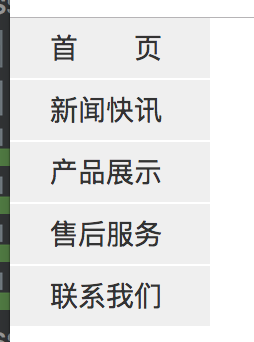
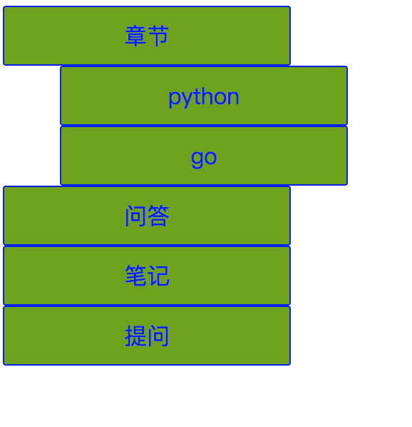

# 案例作业

## 1. 垂直导航栏

1. 要求 鼠标过导航栏变颜色

答案地址: home\_work\_and\_anwser/css/cases/q1.html

## 2. 把上面例子放水平

## 3. 实现三级下拉菜单

#### 说明

1. 鼠标移动到章节 下拉出 python go 菜单
2. 鼠标移动到下拉出来的python 出现 GUI SOCKET等菜单

答案地址: home_work_and_anwser/css/cases/q3.html