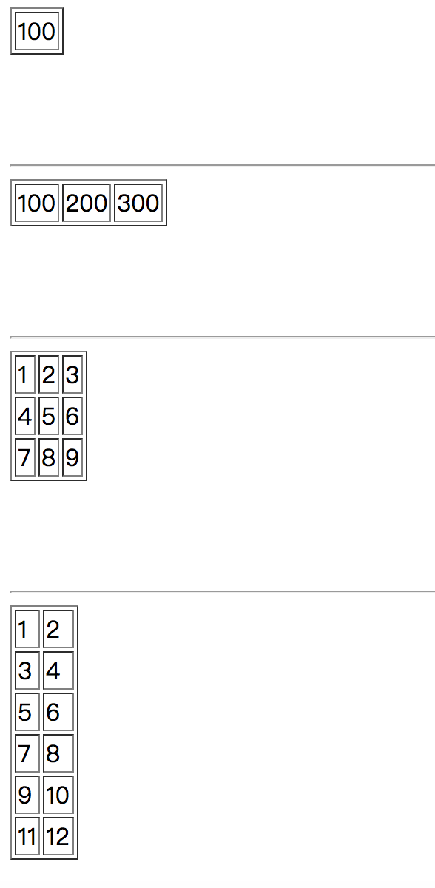
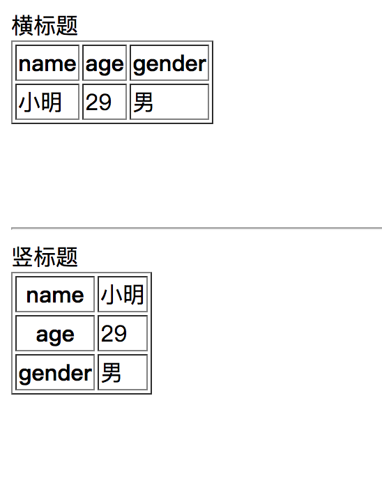

# html 表格和表单

## 表格描述

1. 表格由 table 标签来定义。
2. 每个表格均有若干行（由 tr 标签定义），每行被分割为若干单元格（由 td 标签定义）。
3. 字母 td(table data) 指表格数据，即数据单元格的内容。数据单元格可以包含文本、图片、列表、段落、表单、水平线、表格等等。


#### 示例1

```
<table border="1">
    <tr>
        <td>
            row 1,col 1
        </td>
        <td>
            row 1,col 2
            
        </td>
    </tr>
    <tr>
        <td>
            row 2,col 1
        </td>
        <td>
            row 2,col 2
        </td>
    </tr>
</table>
```


#### 表格标签

| 标签       | 描述    |  
| --------   | -----:  | 
| table      | 定义表格      |   
| th        | 定义表格的表头      |   
| tr        | 定义表格的行      | 
| td        | 定义表格的单元      | 
| caption       | 定义表格的标题      | 
| colgroup       | 定义表格的组     | 
| col        | 定义表格列的属性      | 
| thead        | 定义页眉      | 
| tbody        | 定义表格的主体      | 
| tfoot        | 定义表格的页脚    | 


#### 表格边框属性


如果不定义边框属性，表格将不显示边框。有时这很有用，但是大多数时候，我们希望显示边框。

使用边框属性来显示一个带有边框的表格：
border=“1”    线条宽为1   如果线条宽=0 则没有线条
有单元格边距为10  

	```
			<table border=“1”   cellpadding="10”>
		单元格间距=0
			<table border="1" cellspacing="0”>
		单元格间距=10
			<table border="1" cellspacing="10”>
			
			
			<table cellpadding="10">
			    <tr>
			        <td>
			            row 1,col 1
			        </td>
			        <td>
			            row 1,col 2
			
			        </td>
			    </tr>
			    <tr>
			        <td>
			            row 2,col 1
			        </td>
			        <td>
			            row 2,col 2
			        </td>
			    </tr>
			</table>
	```
### 表格的三大部分

HTML中的table可以大致分为三个部分：

		thead ---------表格的页眉
		tbody ---------表格的主体
		tfoot ---------定义表格的页脚(在最下面,不管代码位置在哪里)
		
thead, tbody, tfoot 相当于三间房子，每间房子都可以用来放东西。

<tr> </tr> 这个标签就是放在三间房子里面的东西，每一个 <tr> </tr> 就是表格一行。

表格的每一行被分为一个个单元格。

每一个单元格就是用来存放数据的，这个数据分为两种：

1. 数据的名称；
	
2. 数据本身。
	
用   th标签 表示数据的名称(标题) ,

td标签表示真正的数据内容。
	
	
	```
	
			<table border="1">
		
		
		    <tfoot>
		    <tr><th>row end col1</th><th>row end col2</th></tr>
		    </tfoot>
		    <tbody>
		    <tr>
		        <td>
		            row 1,col 1
		        </td>
		        <td>
		            row 1,col 2
		
		        </td>
		    </tr>
		    <tr>
		        <td>
		            row 2,col 1
		        </td>
		        <td>
		            row 2,col 2
		        </td>
		    </tr>
		    </tbody>
		
		    <thead>
		    <tr><td>位置</td><td>位置</td></tr>
		    </thead>
		
		</table>
	```

#### 合并单元格

1. colspan 合并列
2. rowspan 合并行

	```
	
	<table cellpadding="10" border="1">
	    <tr>
	        <td colspan="2">
	            row 1,col 1
	        </td>
	
	        <td>
	            row 1,col 2
	
	        </td>
	    </tr>
	    <tr>
	        <td>
	            row 2,col 1
	        </td>
	        <td>
	            row 2,col 2
	        </td>
	        <td rowspan="2">
	            row 1,col 2
	
	        </td>
	    </tr>
	
	    <tr>
	        <td>
	            row 2,col 1
	        </td>
	        <td>
	            row 2,col 2
	        </td>
	
	    </tr>
	</table>
	```


	
## 练习1
完成以下几个图片的练习



## 练习2
完成以下几个图片的练习



## HTML 表单概述

表单是一个包含表单元素的区域。

HTML 表单用于搜集不同类型的用户输入。

表单元素是允许用户在表单中输入内容,比如：文本域(textarea)、下拉列表、单选框(radio-buttons)、复选框(checkboxes)等等。

表单使用表单标签 form标签来设置:

多数情况下被用到的表单标签是输入标签  input标签
输入类型是由类型属性（type）定义的。


form标签属性:

1. action 提交到哪里去(点击表单之后)
2. method 定义提交的方法 get post等方法
3. input标签就是我们常见的输入框里面的内容
4. placeholder 提示我们输入文字
5. required 必须输入


	```
	
	<!--
	    action  表单数据提交时的目的地
	    method  表单提交数据时的方式 ，常用的有get 和 post
	-->
	<form action="tables.html" method="get">
	    <label>账户</label><input type="text" name="test" placeholder=“输入” required>
	    <input type="submit" value="submit">
    </form>
	```
	
	
#### 表单标签


|标签			|描述|
| --------   | -----:  | 
| form|			|定义供用户输入的表单|
| input	|		定义输入域|
| textarea|		定义文本域 (一个多行的输入控件)|
| label	|		定义了 input元素的标签，一般为输入标题|
|fieldset|		定义了一组相关的表单元素，并使用外框包含起|来
|legend		|	定义了 fieldset 元素的标题|
|select		|	定义了下拉选项列表|
|optgroup	|	定义选项组|
|option		|	定义下拉列表中的选项|
|button	|	定义一个点击按钮|
|datalist|		指定一个预先定义的输入控件选项列表|
|keygen	|	定义了表单的密钥对生成器字段|
|output	|	定义一个计算结果|


#### 常见文本输入和密码

1. 我们通过type来定义文本的类型,如果password则不会显示密码里面的字段

2. 我们习惯在使用label表示表单的名称,在label中使用for,指向input中的id就可以在点击label标签的时候,跳转到Input标签中间去

	```

	<form action="tables.html" method="get">
	    <label for='t1'>账户</label><input type="text" name="name" id="t1">
	    <label for="t2">密码</label><input type="password" name="pwd" id="t2">
	    <input type="submit" value="submit">
	</form>
	
	```
	

#### 单选按钮(radio)

type="radio" 标签定义了表单单选框选项

表单中的单选按钮可以设置以下几个属性：value、name、checked
value：提交数据到服务器的值name：为控件命名，以备后台程序 ASP、PHP 使用

checked="checked" 时，该选项被默认选中

	```
	<form action="#" >
	    <input type="radio" name="sex" value="male" checked>male<br>
	    <input type="radio" name="sex" value="female">female<br>
	
	
	</form>
	```
	
1. 思考,为什么两个input的name都是一样的？
2. 如果把name去掉会怎么样?

#### 复选框(checkbox)

type="checkbox" 定义了复选框. 用户需要从若干给定的选择中选取一个或若干选项。

	```
	
	<form action="#" >
	    <input type="checkbox" name="vehicle" value="bike" >i have a bike<br>
	    <input type="checkbox" name="vehicle" value="car" checked>i have a car<br>
	    <input type="checkbox" name="vehicle" value="aircraft">i have a aircraft<br>
	    <input type="submit" value="submit">
	
	</form>
	```
	
#### 下拉列表(select  option)

本例演示如何在 HTML 页面中创建简单的下拉列表框。下拉列表框是一个可选列表。
可以使用<option selected>的方式来创建一个简单的带有预选值的下拉列表。

	```
	<form action="#" >
	    <select name="car">
	    <option value="1">bmw</option>
	        <option value="2">benz</option>
	        <option value="3">audi</option>
	    </select>
	    <input type="submit" value="submit">
	
	</form>
	```
	
#### 带边框的表单(fieldset)

本例演示如何在数据周围绘制一个带标题的框。

	```
	
	<form action="#">
	<fieldset>
	    <legend>
	        fieldset的
	
	    </legend>
	    <label for='t1'>账户</label><input type="text" name="name" id="t1">
	    <label for="t2">密码</label><input type="password" name="pwd" id="t2">
	
	
	</fieldset>
	
	    <input type="submit" value="submit">
	
	
	</form>
	```
	
	
#### 添加文件(file)

文件上传 type=“file"

使用file，则form的enctype必须设置为multipart/form-data，method属性为POST。


	```
	<form action="#" enctype="multipart/form-data">
	
	    <input type="file" name="upfile">
	
	    <button>上传</button>
	
	</form>
	
	```
	
	
| enctype| 意义|
| -----:|----|
|application/x-www-form-urlencoded|在发送前编码所有字符（默认）|
|multipart/form-data|不对字符编码。在使用包含文件上传控件的表单时，必须使用该值。|
|text/plain|空格转换为 "+" 加号，但不对特殊字符编码。|


