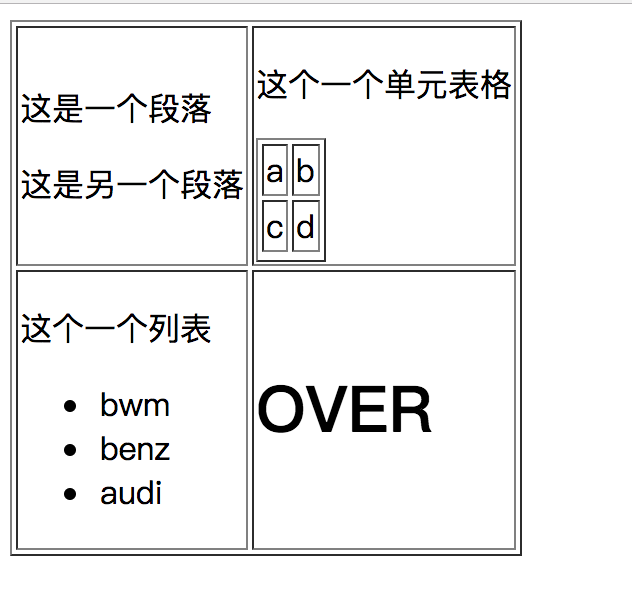
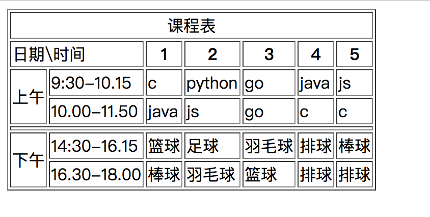
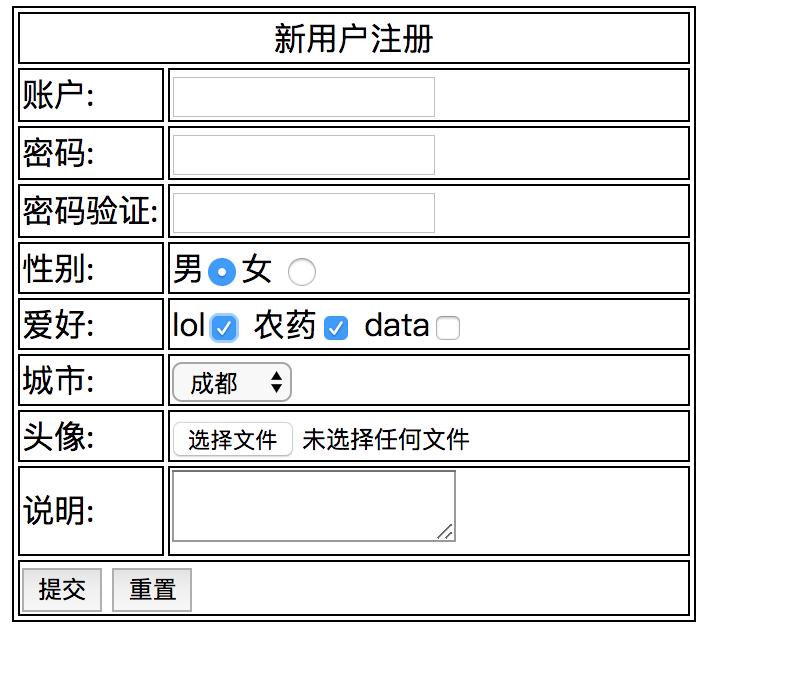

## 课后练习

#### 使用表格或者表单完成下面图表

1. 

2. 

3. 

4. 完成下图  

资料地址 

<a href="./lol.pdf" download="./lol.pdf">英雄联盟资料.pdf <a>

图片地址

<a href="./imagestest.zip" download="./imagestest.zip">magestest.zip<a>