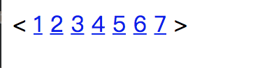

## 课后练习

1. 使用html列表完成下面图片

1. 使用html完成下面图片

2. 完成下面的要求

4. 简答什么是html语义化

5. html标签和元素的区别

6. 简答浏览器获取网页的完整大体流程

7. html css js的区别和功能是什么？

8. 标记语言是什么意思?请再写出两种编辑语言并说明他们的用途

9. h5播放器和 flash播放器的有什么不同点

10. 如何区分 HTML 和 HTML5
