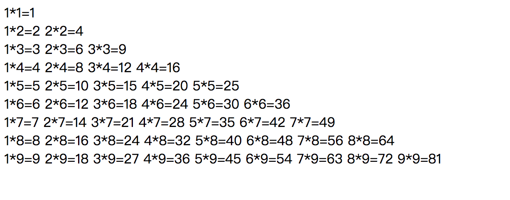

# js循环语句练习

> 答案地址 home\_work\_and\_anwser/js/js\_construtions\_homework\_answer.html

#### 1. 实现下面的99乘法表

输出结果为：




#### 2. 实现下面的星星形状

	1.
	
	```javascript
	
	   *       
	  ***      
	 *****     
	*******    
	```

	2.
	
	 提示：
 Math.ceil() 向上取整
 Math.abs()  取绝对值
	
	```javascript
	
	   *     
	  ***     
	 *****    
	  ***    
	   *    
	
	```
	
	3.
	
	```
	
	    *
	   * *
	  *   *
	 *     *
	*       *
	 *     *
	  *   *
	   * *
	    *
  
	```
	
#### 3. 翻转图形

使正方形向右倒90度

给出算法函数

```

给出如下图形
[
  [1,2,3],
  [4,5,6],
  [7,8,9]
],

输出如下图形

[
  [7,4,1],
  [8,5,2],
  [9,6,3]
]
//---------//

给出如下图形 
[
  [ 5, 1, 9,11],
  [ 2, 4, 8,10],
  [13, 3, 6, 7],
  [15,14,12,16]
], 

输出如下图形
[
  [15,13, 2, 5],
  [14, 3, 4, 1],
  [12, 6, 8, 9],
  [16, 7,10,11]
]
```

#### 4. 排序

给出存数字数组 [1, 8, 3, 2, 9, 5, 4, 7]

返回排序后的值 [1, 2， 3， 4， 5， 7，8，9]

给出算法函数

#### 5. 搜索

给出矩阵如

```

        var matrix = [
            [1, 3, 5, 7],
            [10, 11, 16, 20],
            [23, 30, 34, 50]
        ];

```

给出一个数字 如 50 如果50在矩阵之中 则返回 true