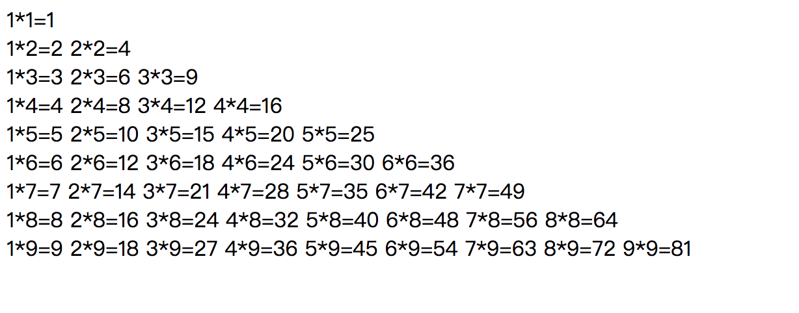

# js 结构作业

#### 1. 使用js 循环代码实现以下三角形图形


```
// 示例1
/*
   *       i = 1   space = 3  star = 1
  ***      i = 2   space = 2  star = 3
 *****     i = 3   space = 1  star = 5
*******    i = 4   space = 0  star = 7
row = 4
space = row - i;   star = 2 * i - 1
*/
```


#### 2. 使用js 循环代码实现以下菱形图形

```
// 示例2
/*
   *      i = 1  space = 2 4  star = 1
  ***     i = 2  space = 1 2  star = 3
 *****    i = 3  space = 0 0  star = 5
  ***     i = 4  space = 1 2  star = 3
   *      i = 5  space = 2 4  star = 1

 提示：
 Math.ceil() 向上取整
 Math.abs()  取绝对值

 row = 5
 space = Math.abs(Math.ceil(row/2) - i);
 star  = row - 2 * space
*/
```

#### 3. 使用js 循环代码实现以下99乘法表

