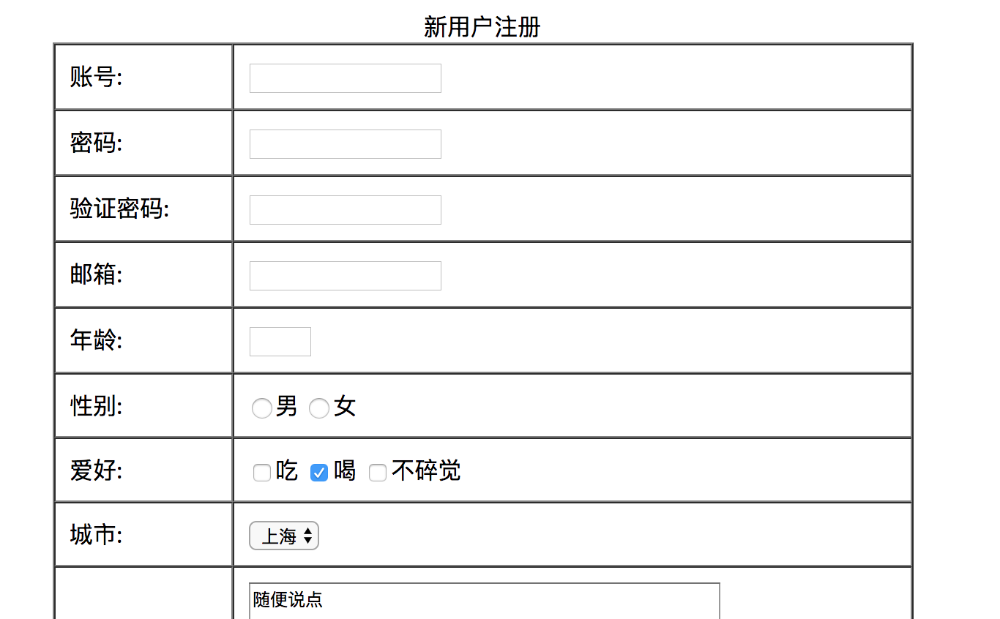
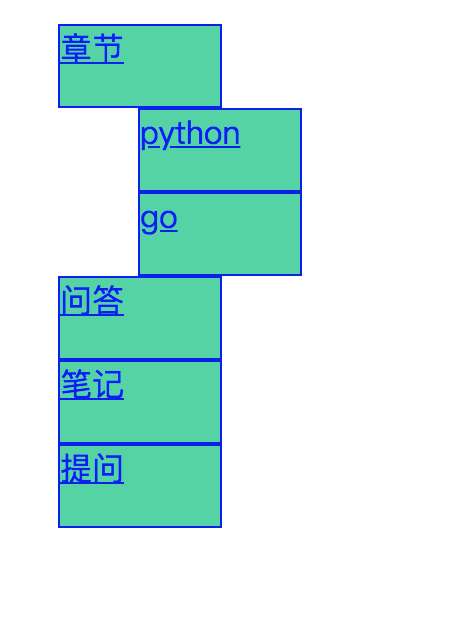

1. 使用js显示 html显示动态的时间

	>js/js\_cases\_code/dynamic\_times.html
	
	

2. 显示图片 鼠标过去图片显示大图片
	>js/js_cases_code/pics_big.html
	
	
	
3. 验证表单 给表单加入验证参数比如在没有填写账户的时候 提示输入账户

	>js/js_cases_code/form_vali.html
	
	
	
4. 使用js实现二级下拉

   > js/js\_cases\_code/menus.html
   
   