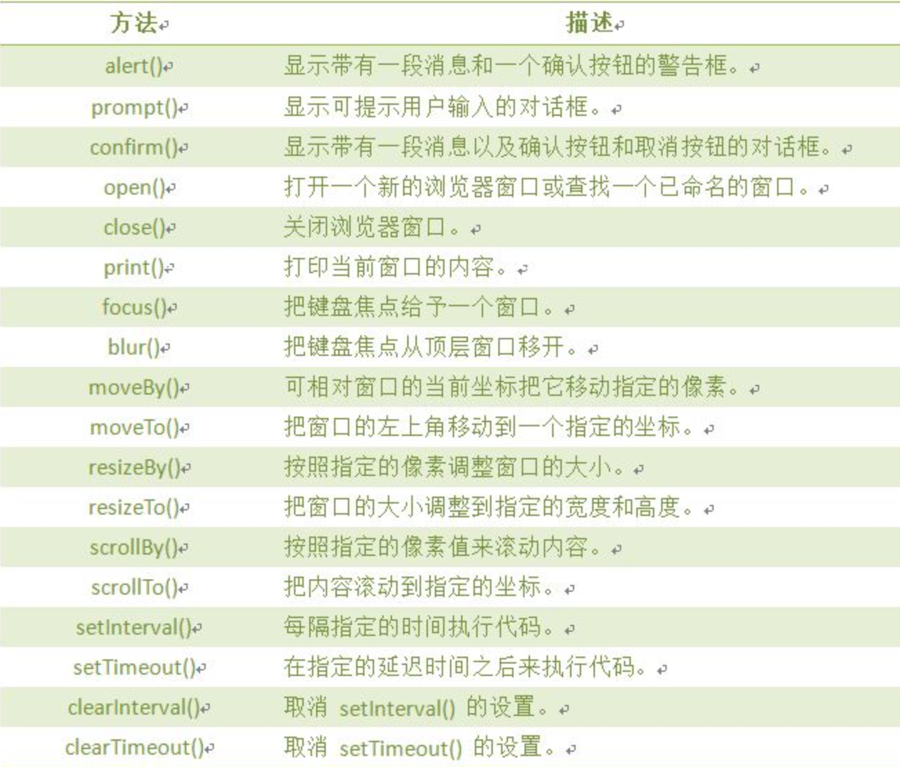

# 浏览器对象

## 概述

浏览器对象, bom,是由浏览器提供的api接口,让用户使用

## 详细

#### window对象

window对象是BOM的核心，window对象指当前的浏览器窗口。
我们的 alert 就是一个典型的window对象




#### 计时器

说明: 在JavaScript中，我们可以在设定的时间间隔之后来执行代码，而不是在函数被调用后立即执行。

一次性计时器：仅在指定的延迟时间之后触发一次。
间隔性触发计时器：每隔一定的时间间隔就触发一次。

1. 计时器setInterval() clearInterval(i)
>说明:

    1. 在执行时,从载入页面后每隔指定的时间执行代码。
    2. 交互时间：周期性执行或调用表达式之间的时间间隔，以毫秒计（1s=1000ms
	
	```
	<!DOCTYPE HTML>
	<html>
	<head>
	    <meta http-equiv="Content-Type" content="text/html; charset=utf-8">
	    <title>计时器</title>
	    <script type="text/javascript">
	        var inter = setInterval("clock()",100);
	        function clock(){
	            var time=new Date();
	            document.getElementById("clock").value = time;
	        }
	
	
	    </script>
	</head>
	<body>
	<form>
	    <input type="text" id="clock" size="50"  />
	    <input type="button" value="Stop"  onclick="clearInterval(inter)"/>
	</form>
	</body>
	</html>
	
	```
	
2. 计时器setTimeout()

 说明: setTimeout(代码,延迟时间);
 
 ```
 
 <!DOCTYPE HTML>
<html>
<head>
    <script type="text/javascript">
        var num=0,i;
        function timedCount(){
            document.getElementById('txt').value=num;
            num=num+1;
            i=setTimeout(timedCount,1000);
        }
        setTimeout(timedCount,1000);
        function stopCount(){
            clearTimeout(i);
        }
    </script>
</head>
<body>
<form>
    <input type="text" id="txt">
    <input type="button" value="Stop" onClick="stopCount()">
</form>
</body>
</html>

 ```