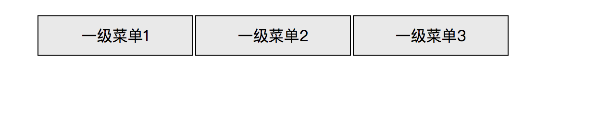
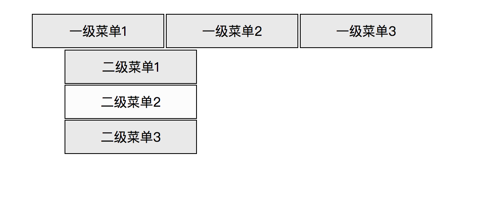
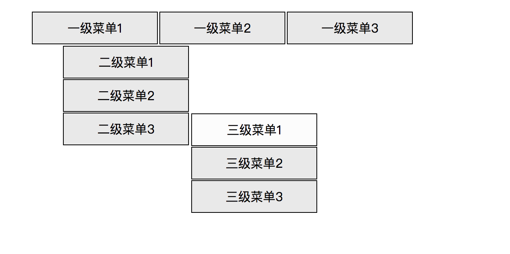
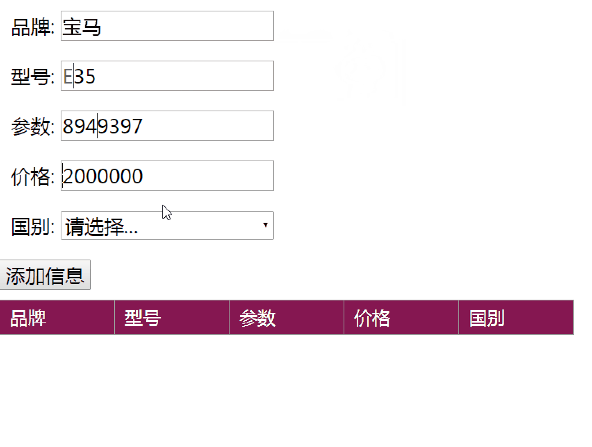
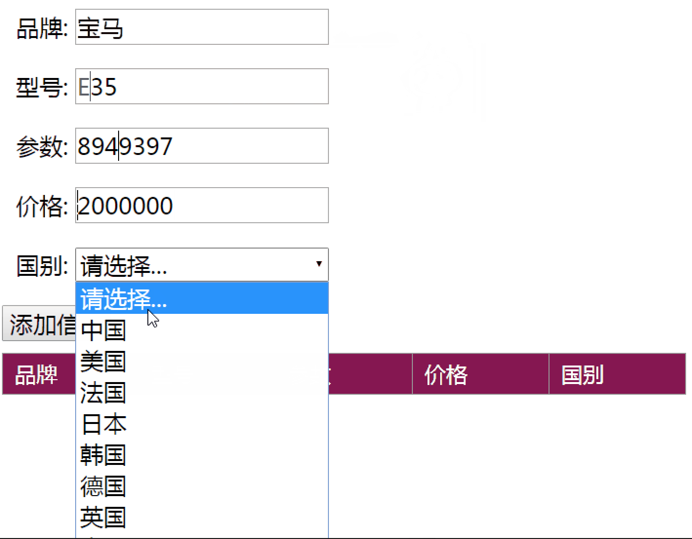
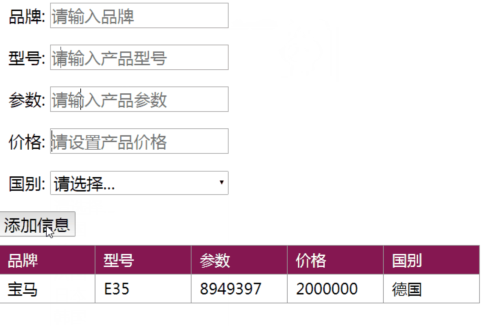

# p1804 结业考试

## 提交方式
试题完成后提交至邮箱

1210999688@qq.com

考试时间 9:00-12:00

超过时间未提交0分

## 1. 下拉框（总分 40）





说明:

1. 实现三级下拉框
2. 一级下拉框为为横向
3. 二级三级下拉框为纵向
4. 三级下拉框的位置要和二级下拉框(二级菜单3)平行

分数说明:

1. 实现三级下拉框基本结构 60%
2. 实现三级菜单在二级菜单平行处 30%
3. 实现hover变颜色 10%

## 2. 产品信息添加 （总分 40）





说明:

1. 在上图中可以在表单中添加产品信息
2. 点击添加信息之后能在下方添加出数据来

分数说明:

1. 实现表单 (25%)
2. 表单有验证机制,输入的参数不能为空 (25%)
3. 有品牌 信号 参数等的css样式 (20%)
3. 点击添加能成功添加出信息出来 (30%)

## 3. js算法实现(总分20)

#### 1.罗马字转整数

1. 说明:
	1. 罗马数字共有七个,即I(1),V(5),X(10),L(50),C(100),D(500),M(1000).按照下面的规则可以表示任意正整数.
	2. 重复数次：一个罗马数字重复几次,就表示这个数的几倍.
	3. 右加左减：在一个较大的罗马数字的右边记上一个较小的罗马数字,表示大数字加小数字.在一个较大的数字的左边记上一个较小的罗马数字,表示大数字减小数字.但是,左减不能跨越等级.比如,99不可以用IC表示,用XCIX表示.
	4. 加线乘千：在一个罗马数字的上方加上一条横线或者在右下方写M,表示将这个数字乘以1000,即是原数的1000倍.同理,如果上方有两条横线,即是原数的1000000倍.
	5. 单位限制：同样单位只能出现3次,如40不能表示为XXXX,而要表示为XL.

2. 算法实现:

输入罗马字符 转换为整数输出 如下:

	```
	        var a = "III"; //3
	        var b = "IV"; //4
	        var c = "XL"; //40
	        var d = "XCIX"; //99
	
	```

#### 2. 数组排序

##### 1. 只能使用一行代码来实现

##### 2. 给出 [5,3,7,2,3,9,0,6,1,3,2] 输出排序之后的数组(正序) [0,1,2,3,4,5,6,7,8,9]

> 提示: 三元运算


